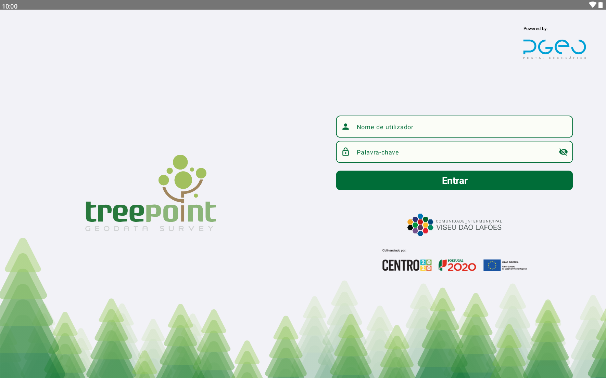
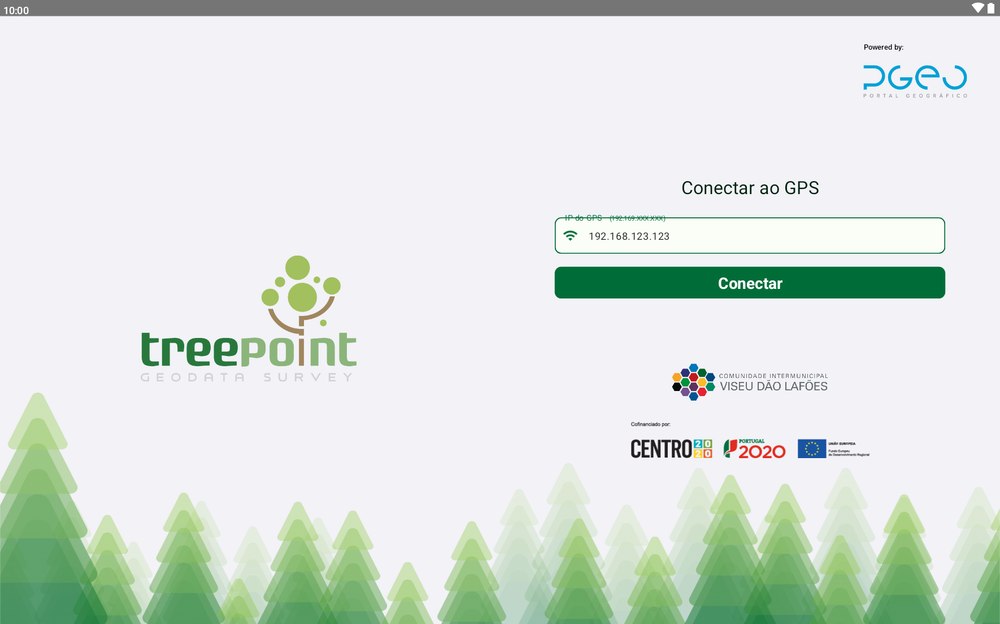
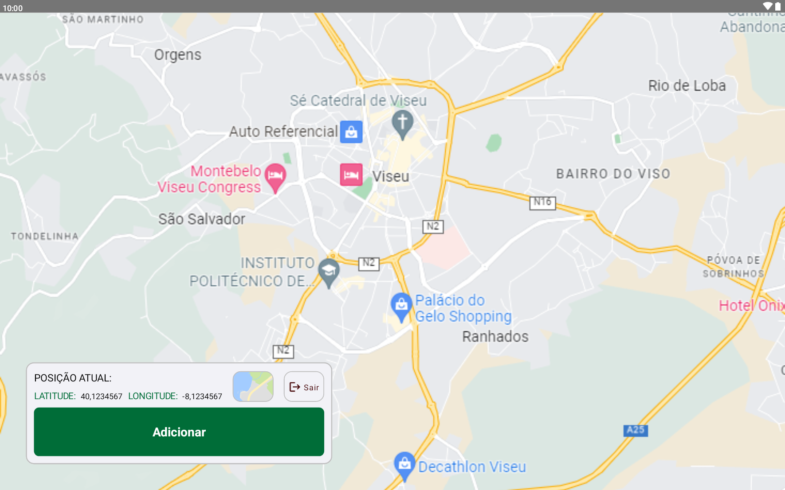
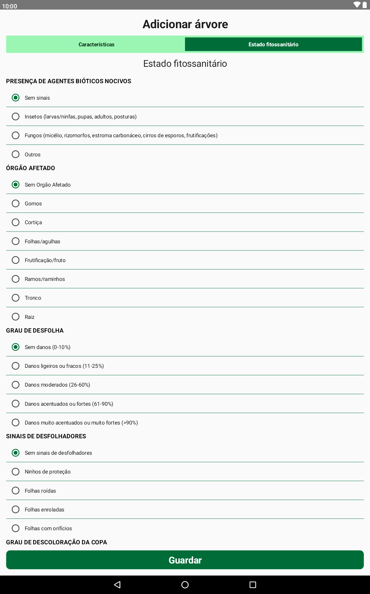
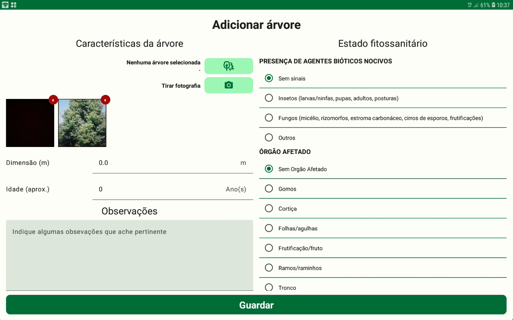

  

A aplicação TreePoint, desenvolvida no âmbito das duas Comunidades Intermunicipais de Coimbra e Viseu Dão Lafões (doravante CIM's), visa apoiar o registo arbóreo de cada região. A aplicação utiliza uma ligação por Bluetooth a um GPS externo que é colocado em cada árvore. Em seguida, um técnico preenche os dados da árvore no dispositivo móvel. Assim que possível, o registo é enviado para a base de dados. A aplicação permite agregar uma ou mais fotografias da árvore ao registo.

## Funcionalidades

- Registo de árvores com geolocalização por via de GPS externo (conectado via Bluetooth)
- Preenchimento e envio de dados das árvores para a base de dados
- Capacidade de adicionar fotografias ao registo de cada árvore

## Tecnologias Utilizadas

- **Linguagem:** Kotlin com arquitetura MVP
- **UI:** Jetpack Compose
- **Base de Dados:** Room database para offline first app
- **Cliente HTTP:** Retrofit
- **Injeção de Dependências:** Dagger/Hilt

## Layouts e Imagens

<table>
  <tr>
    <td>
      
    </td>
    <td>
      
    </td>
  </tr>
  <tr>
    <td>
      
    </td>
    <td>
      
    </td>
  </tr>
  <tr>
    <td>
        
    </td>
    <td>
        
    </td>
  </tr>
</table>

## Contribuições

Este projeto visa facilitar o registo e monitorização de árvores nas regiões das CIMs, proporcionando uma ferramenta eficiente para os técnicos em campo.

## Licença

Este projeto não contém código fonte devido a restrições de propriedade intelectual da empresa anterior.